# Helios

[](VERSION.txt)
[](LICENSE)

An interactive 3D orrery of the solar system.

## [▶ Play Helios in your browser](https://xenovoyage.github.io/Helios/)

[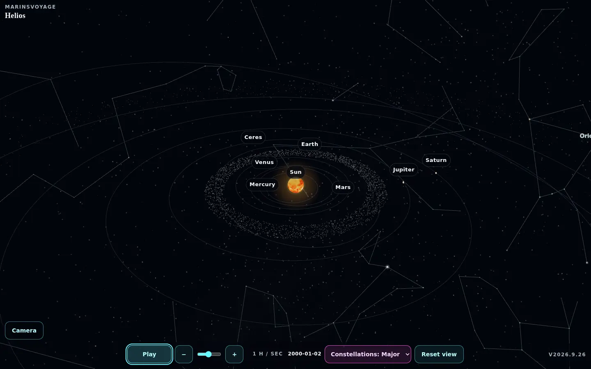](https://xenovoyage.github.io/Helios/)

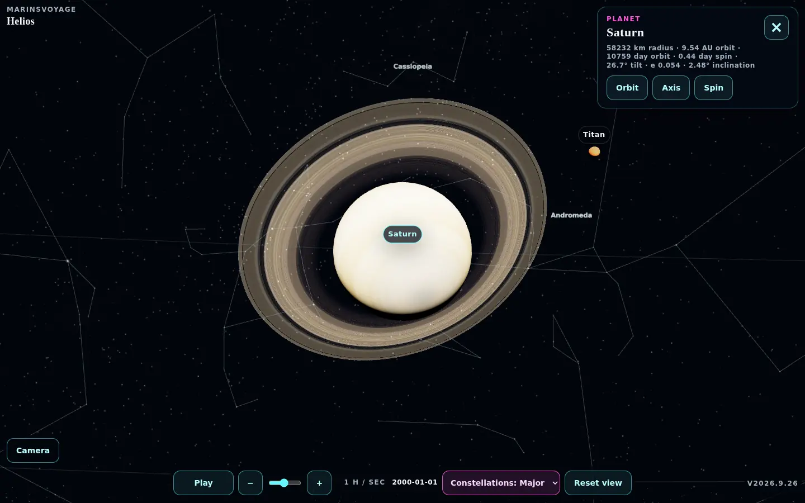

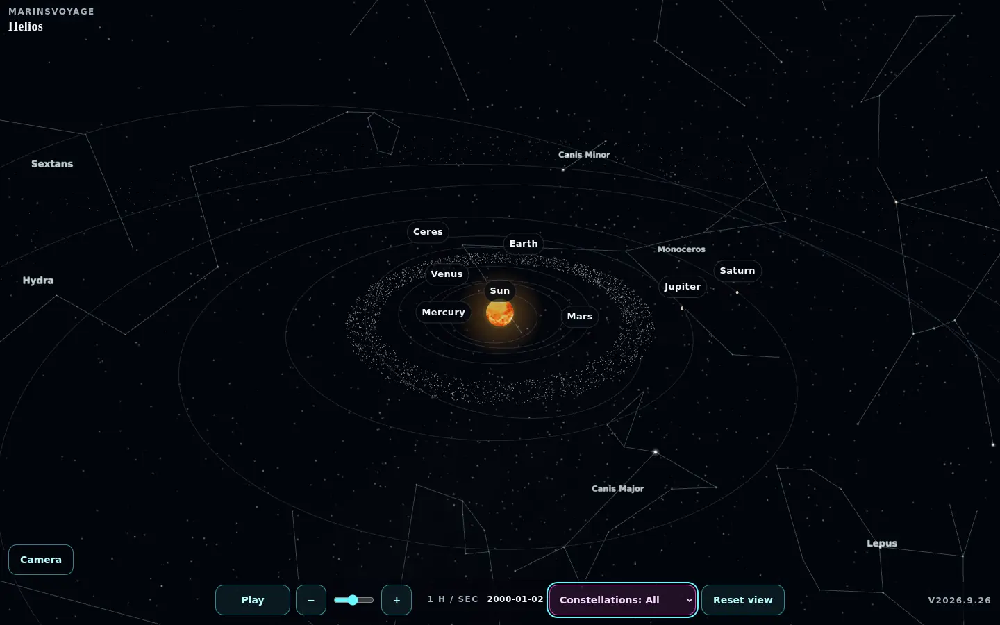

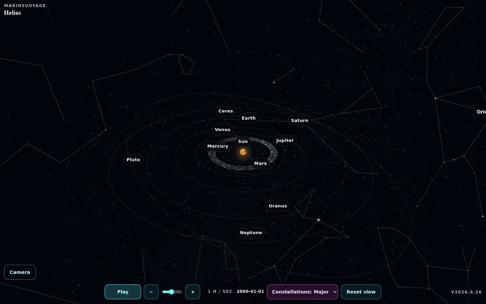

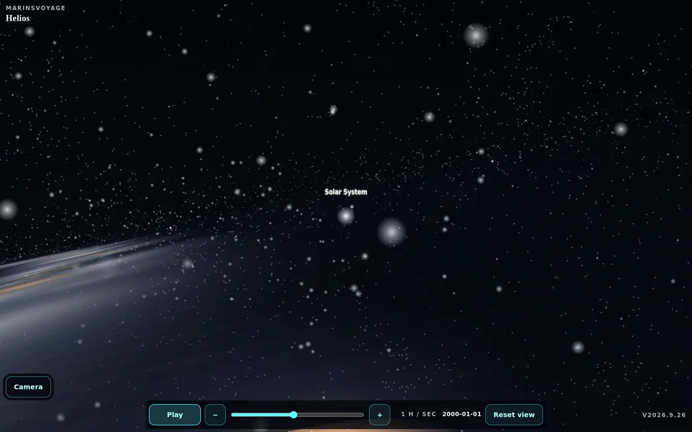

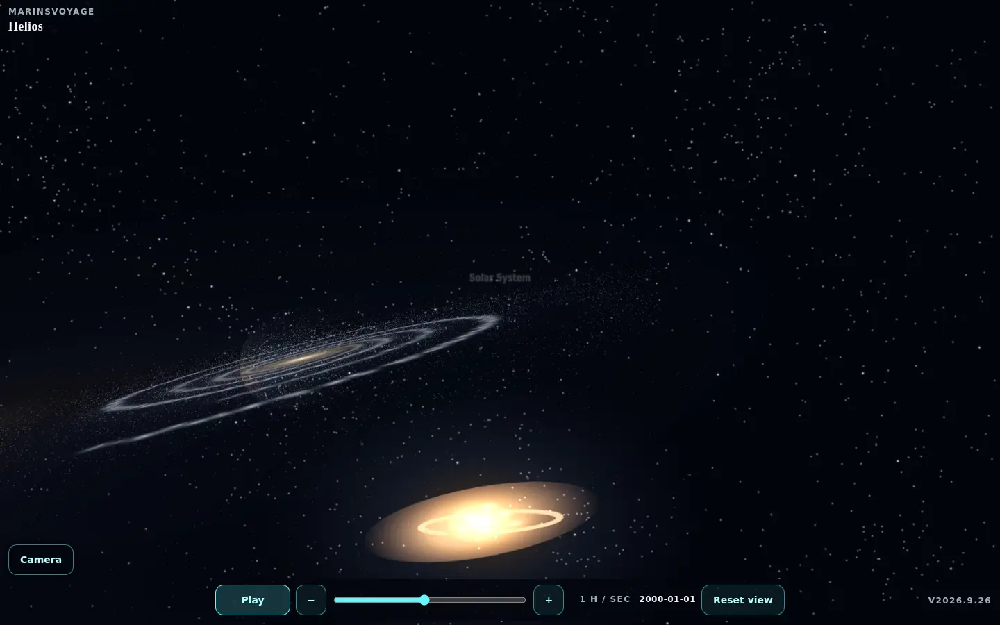

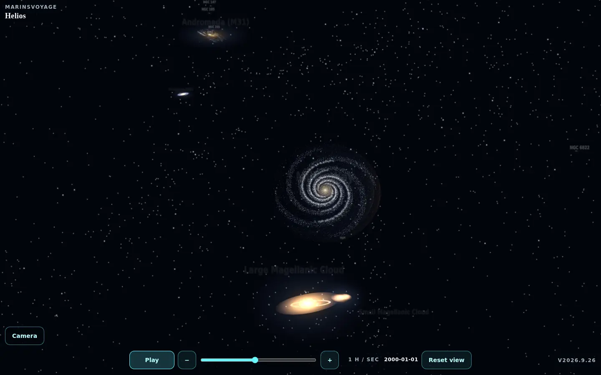

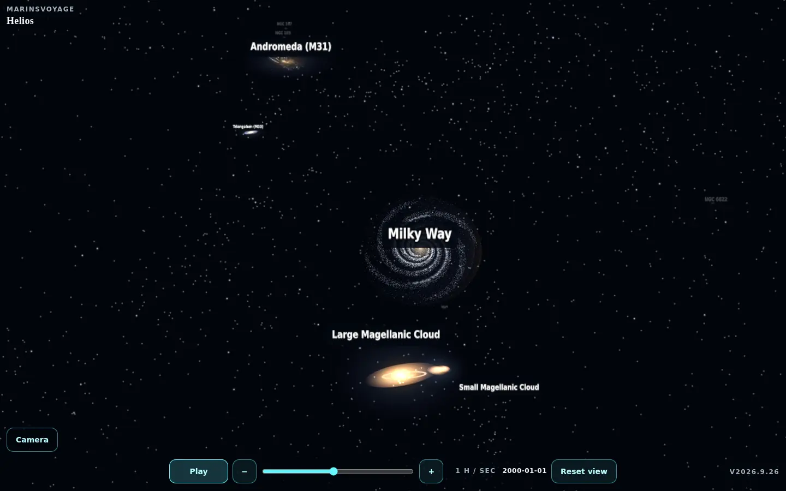

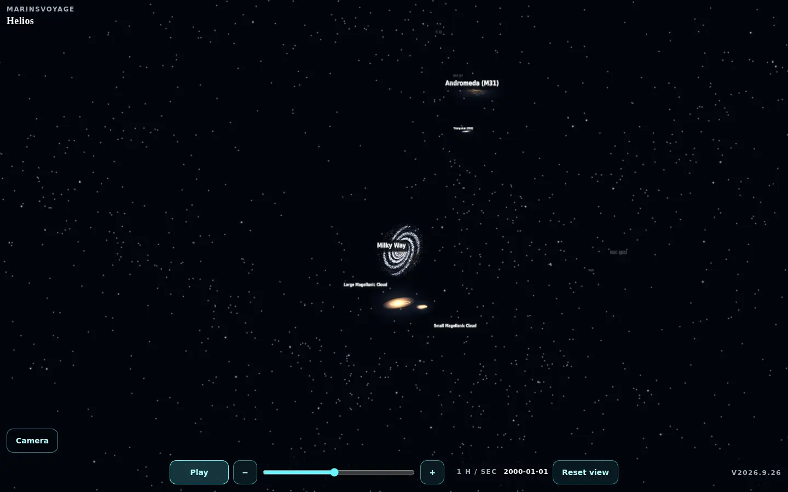

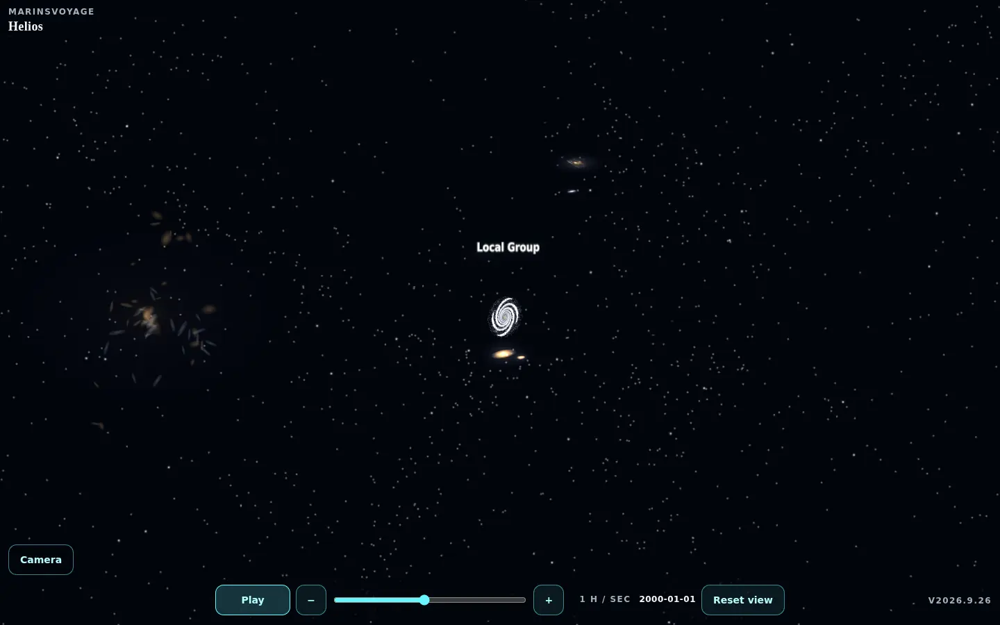

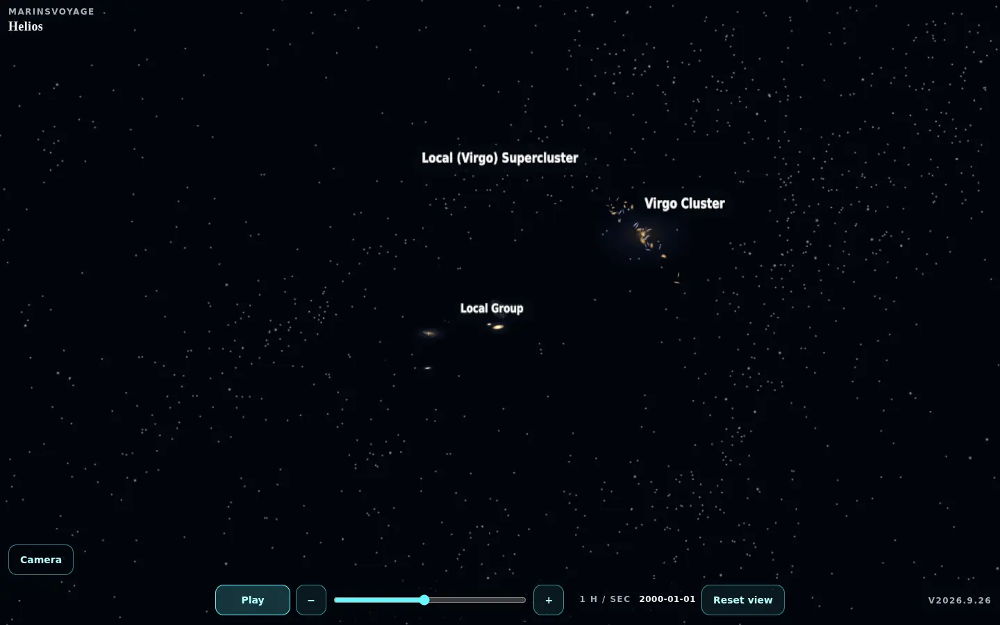

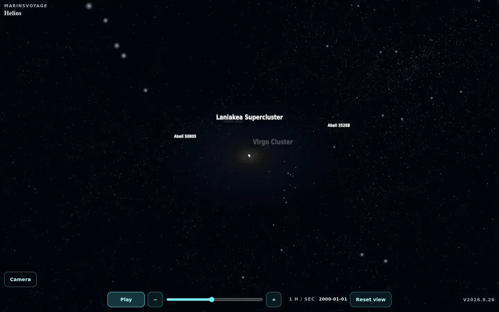

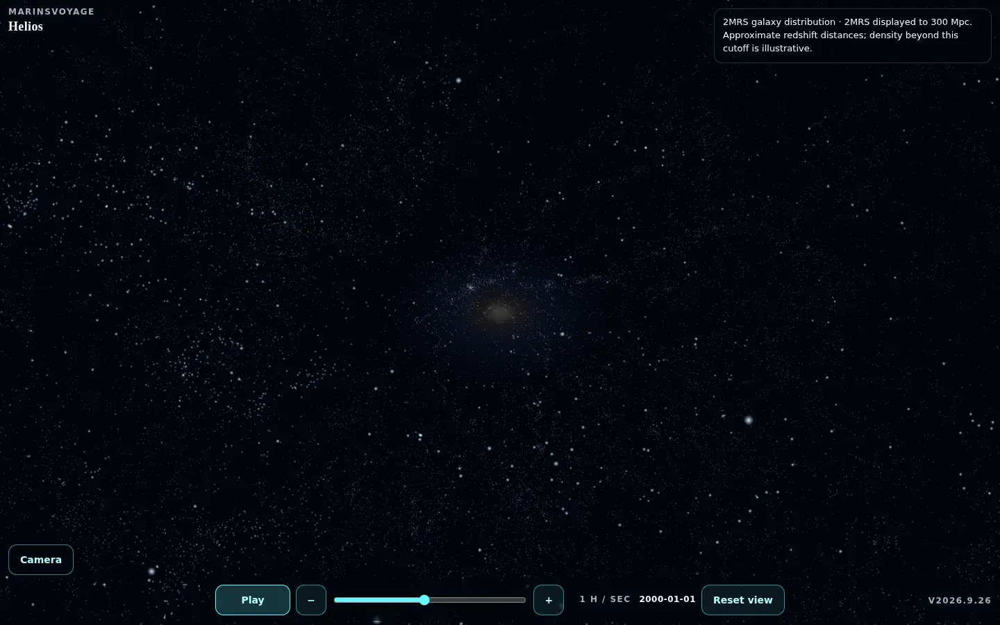

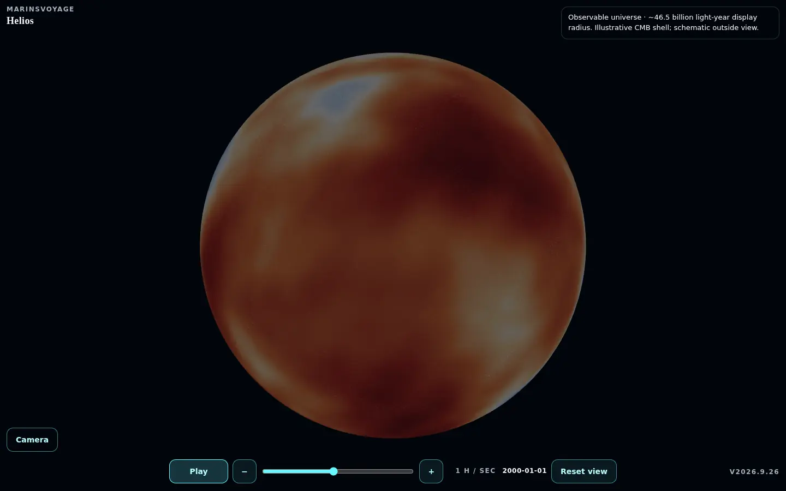

Tap or click a world — including the Sun — to focus it. Drag to orbit. Pinch-out zooms in; pinch-in zooms out. Play, pause, and change the speed of time from the bar at the bottom. Close the body card with the X or by tapping empty space. Zoom out past the solar overview and the orrery shrinks to a Sun among the stars. The Hipparcos sky, IAU figures, and Gaia band stay at constant brightness through the solar cap, so the first extra-zoom frame is already inside the Milky Way tail. The moment the camera leaves that tail, that solar sky and the Constellations control go off. Extra-zoom sky is a distant galaxy-image field from the tail through Virgo. The full disk, neighborhood, Local Group, and Virgo are catalog neighbors against that field, not a scatter of invented nearby galaxies. After Virgo, seven measured group anchors lead into 42,927 public 2MRS galaxy directions with approximate redshift distances; there are no invented web connections. Beyond the survey's 300 Mpc display cap, a small first-party density illustration provides continuity to the Planck-style CMB shell. That shell is deliberately drawn at the particle-horizon display radius. Leaving it is only an outside-camera/scale metaphor, not a physically possible observer. We sit in the Local Group, inside Laniakea; Virgo is the nearest large cluster, not our cluster in the same sense.

Helios is a local page: no accounts, no telemetry, and no CDN.

## At a glance

| Detail | Summary |
| --- | --- |
| Worlds | Sun, 8 planets, the Moon, Phobos, Deimos, Io, Europa, Ganymede, Callisto, Titan, Triton, Pluto, and Ceres |
| Sky | Hipparcos bright stars, an 88-constellation figure catalog, a Milky Way band, and Andromeda at M31 inside the solar system. Ten familiar constellation names are labeled deliberately so tags do not crowd planet controls. That sky remains constant through the solar cap and into the Milky Way tail, then turns off. After the tail a distant galaxy-image field stays up through Virgo behind catalog neighbors. Beyond Virgo, measured 2MRS galaxy points yield to an explicitly illustrative outer density and CMB shell. |
| Belts | Asteroid field between Mars and Jupiter; nominal Kuiper field from about 30–50 AU. Sparse points, not rock catalogs; Pluto's eccentric visual path crosses the field's drawn edges |
| Time | Independent of visual scale. Default/minimum: 1 simulated hour per real second. Background time catches up on return; JavaScript's last valid date is the hard stop |
| Play with | Mouse, keyboard, or touch |

## Visual scale

True 1:1 distances make every planet vanish beside the Sun. Helios retains published NASA / JPL periods, spins, tilts, radii, and Keplerian elements in its catalog, then compresses **distances more than sizes** so the system can be read at a glance. The one planet-spacing knob is `CONFIG.visualScale` in `js/config.js`; it multiplies a compressed AU curve (`orbitScale * AU^orbitPower`). Body sizes use the same kind of curve (`sizeScale * (radius/Earth)^sizePower`). Moons share that size curve. Moon distances stay a compressed real-radii map: outside their parent, just outside any rings, and outside a readable gap from the next inner sibling. Calendar positions use fixed J2000 mean elements with two-body propagation, not JPL Horizons or a perturbation ephemeris. The Sun, planets, Ceres, Pluto, and Moon use fixed J2000 PCK poles. Earth and Moon also use verified prime-meridian phases; inherited maps without a retained longitude-registration record keep their closest previous display roll rather than claim an unverified scientific longitude. Except for the Moon, synchronous moon rates only prevent secular longitudinal drift: their simple axes and texture phases are not registered near-side models. The lunar model shows bounded geometric libration but not the complete time-varying PCK model. Lighting supplies a terminator and readable night-side fill, not cast shadows or eclipses. Time is a separate slider.

The Milky Way disk is a deterministic, stylized four-arm illustration. Its catalog distances and the Sun's Orion Arm label are sourced, but the visible arm particles are not a survey reconstruction. The later 2MRS view is observational but still selective: it is K-band flux-limited, omits the Galactic Zone of Avoidance, and maps barycentric radial velocity to `D=cz/H0` rather than correcting peculiar velocities. It must not be read as a complete matter-density reconstruction.

## Run locally

```sh
npm ci
npx playwright install chromium
npm test
npm run serve
```

The first two commands install the pinned test dependency and browser for a clean checkout. Then open `http://127.0.0.1:4173/Helios/`. Opening `index.html` through a local static server also works. A WebGL browser is required.

| Action | Desktop | Touch |
| --- | --- | --- |
| Orbit | Drag | One finger |
| Zoom | Scroll | Pinch |
| Focus | Click a world, the Sun, or a label | Tap a world, the Sun, or a label |
| Close card | Click empty space or X | Tap empty space or X |
| Play / pause | Space or Pause | Pause |
| Speed | `+` / `-` or the slider | − / + or the slider |
| Constellations | Constellations toggle | Constellations toggle |
| Overview | Escape or Reset view | Reset view / Overview |

## Credits

Planet, Sun, Moon, and Ceres maps are [Solar System Scope](https://www.solarsystemscope.com/textures/) textures (CC BY 4.0); that publisher discloses saturation and fictional gap filling, and categorizes its Ceres map as fictional. Most moon maps are from [NASA 3D Resources](https://github.com/nasa/NASA-3D-Resources). Triton uses NASA/JPL-Caltech/LPI [PIA18668](https://www.jpl.nasa.gov/images/pia18668-map-of-triton/) with incomplete Voyager coverage and a neutral no-data fill. Bright-star positions are a Hipparcos subset compiled through [HYG](https://www.astronexus.com/projects/hyg). Constellation stick figures are the [IAU / Alan MacRobert figures](https://www.iau.org/public/themes/constellations/) (CC BY 4.0). The Milky Way band is [ESA Gaia DR2](https://sci.esa.int/web/gaia/-/60196-gaia-s-sky-in-colour-equirectangular-projection) (CC BY-SA 3.0 IGO). Andromeda is NASA/JPL-Caltech [Spitzer PIA04921](https://images.nasa.gov/details/PIA04921). Post-Virgo galaxy directions and redshifts are from NASA HEASARC's [2MRS catalog](https://heasarc.gsfc.nasa.gov/w3browse/all/twomassrsc.html), Huchra et al. 2012. Catalog values and scientific sources are recorded beside the data and in [PROVENANCE.md](PROVENANCE.md); that ledger also records transformations, hashes, limitations, and unresolved source versions. Three.js is vendored under MIT.

First-party code is released under the [MIT License](LICENSE). Third-party images, data, and Three.js retain the terms documented in [PROVENANCE.md](PROVENANCE.md).
