# Helios

[](VERSION.txt)
[](LICENSE)

An interactive 3D solar system and universe explorer.

## [▶ Play Helios in your browser](https://xenovoyage.github.io/Helios/)

[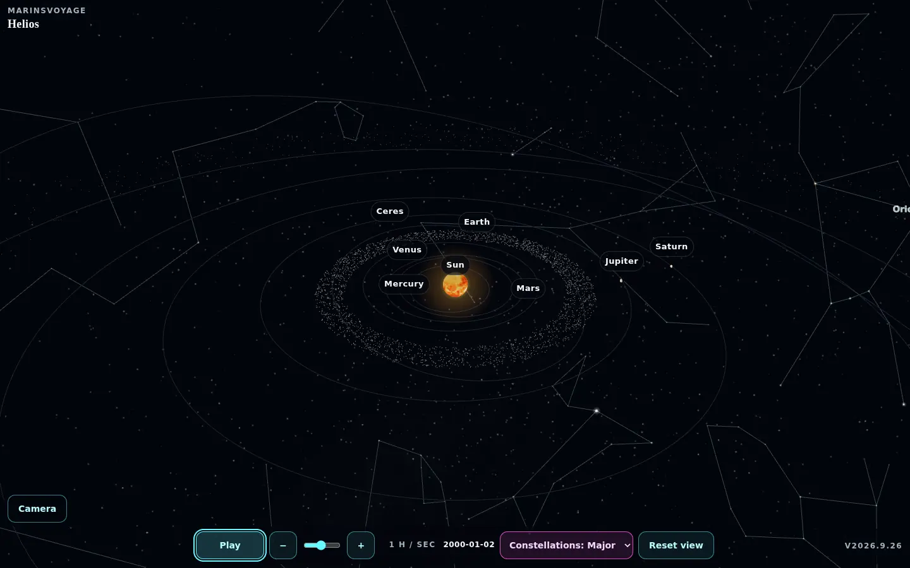](https://xenovoyage.github.io/Helios/)

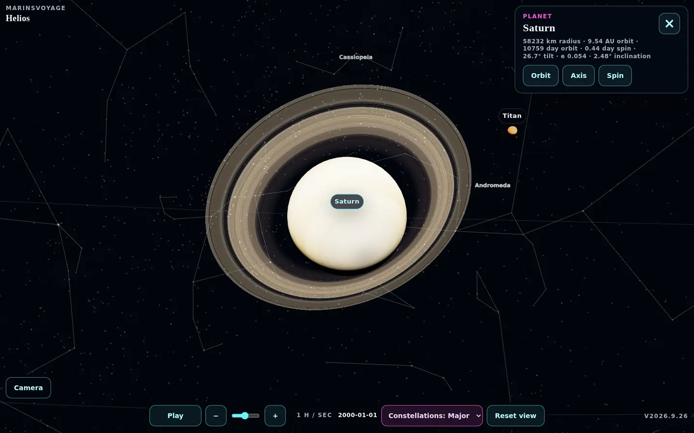

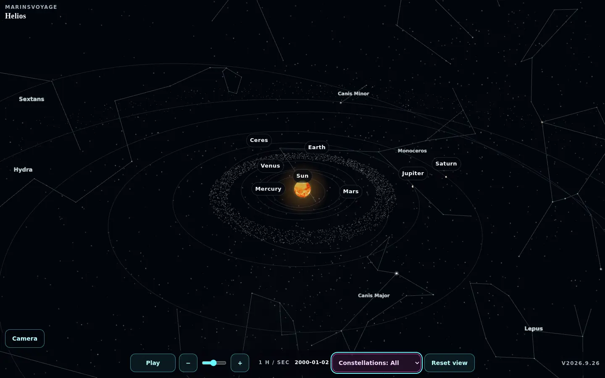

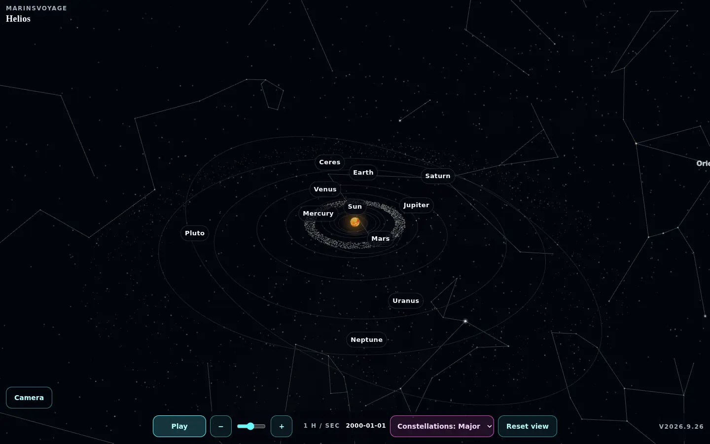

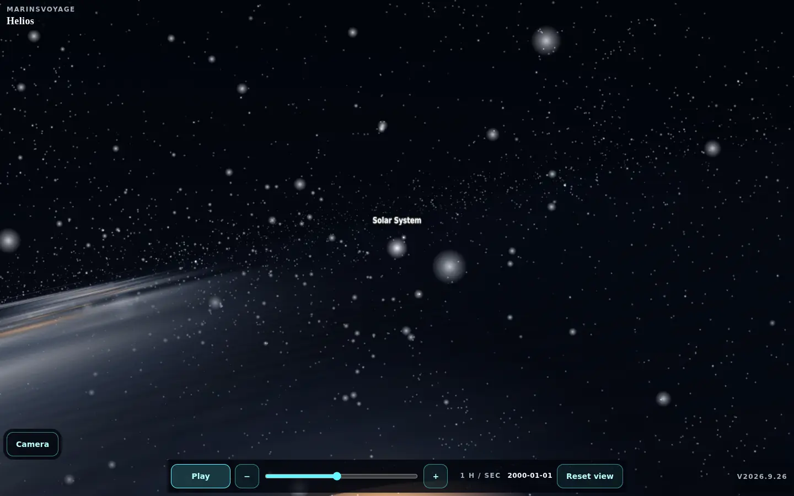

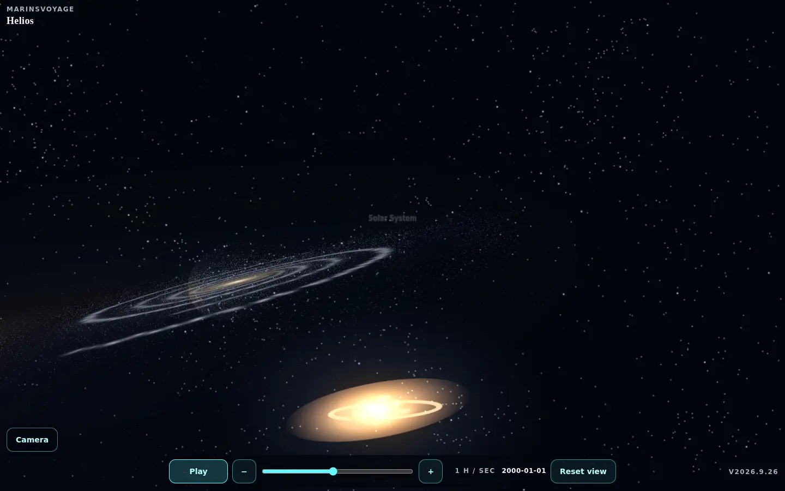

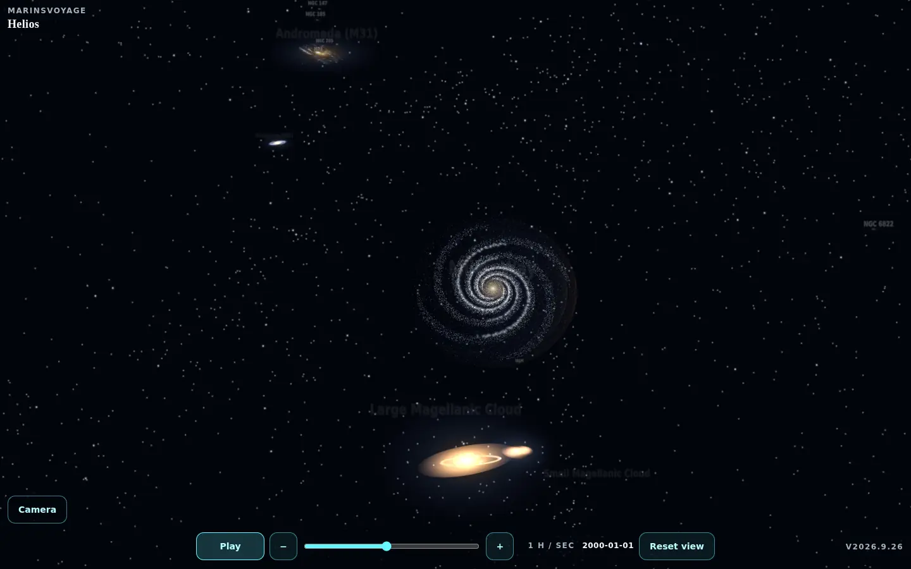

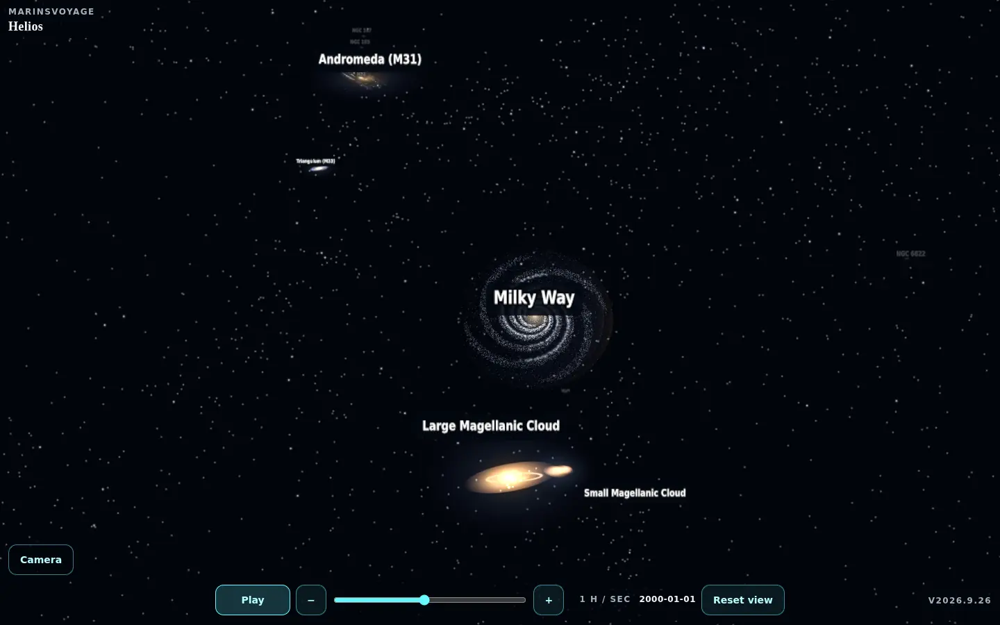

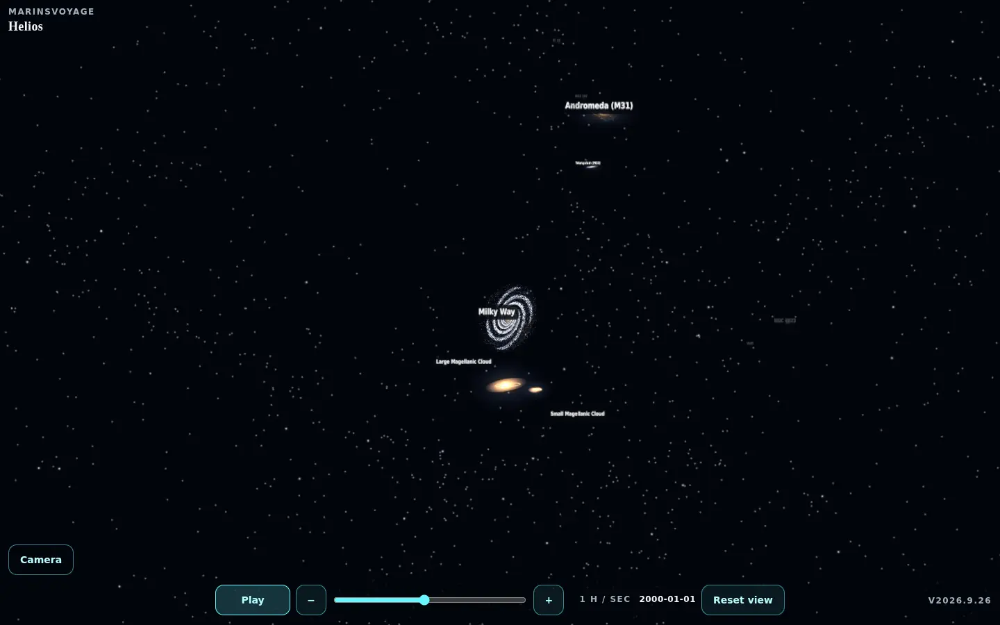

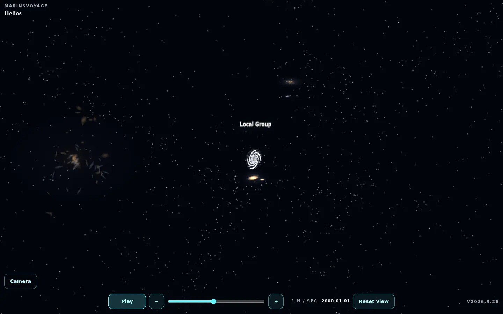

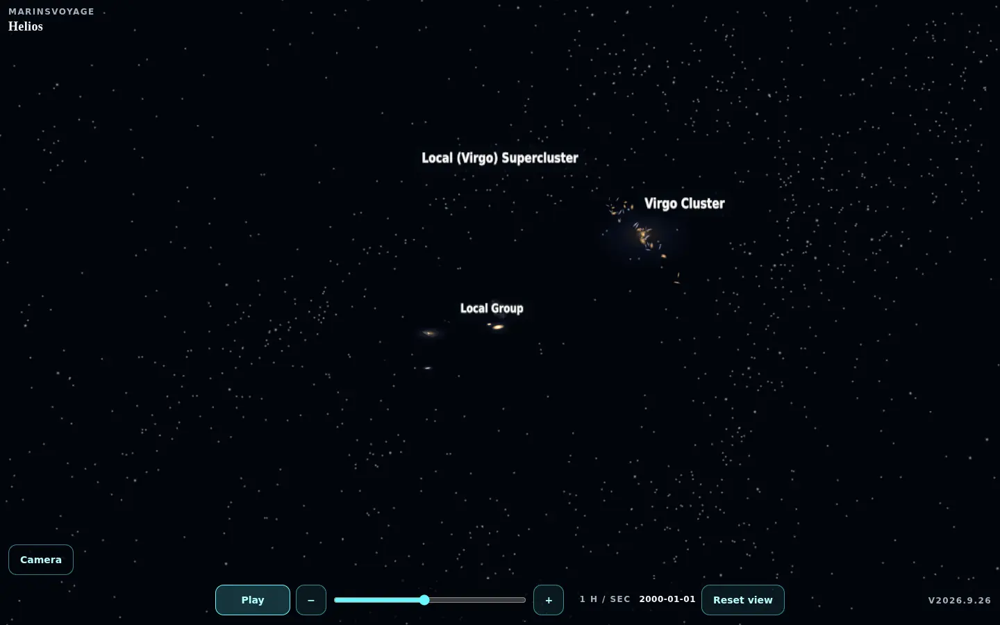

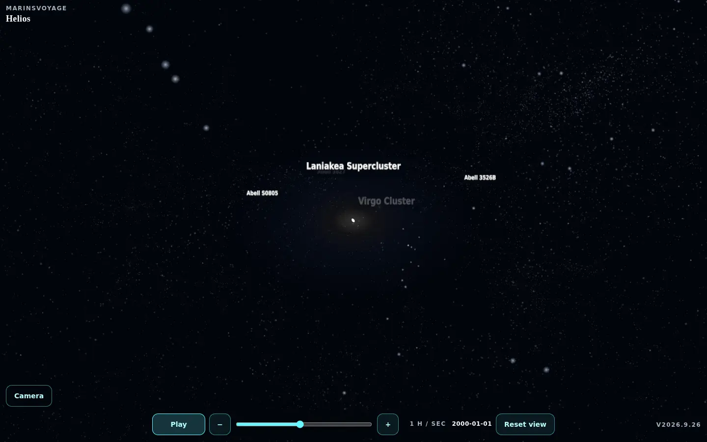

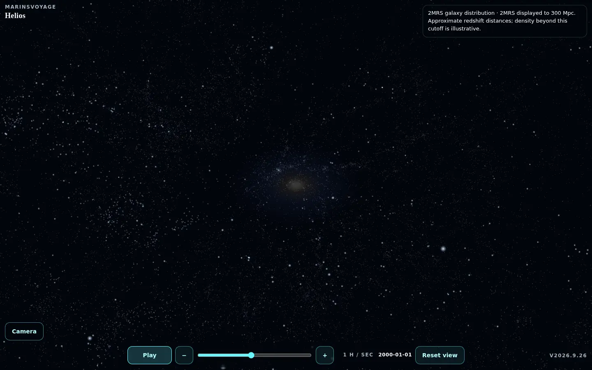

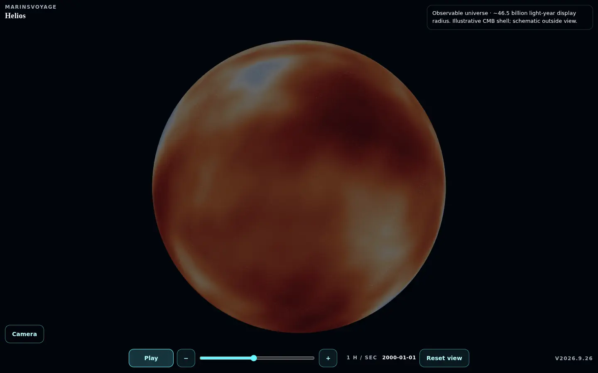

Screenshots show v2026.9.26; [capture sources and image credits](PROVENANCE.md#readme-screenshot-sources).

Tap or click a world, including the Sun, to focus it. Drag to orbit, pinch or scroll to zoom, and use the bottom bar to play, pause, or change the speed of time. Close the body card with the X or by tapping empty space. Zoom out past the planets and the view continues through the Milky Way, nearby galaxies, and a schematic observable universe. Distances and sizes are compressed so the scene stays readable; what is measured, inherited, or only illustrated is recorded in [AGENTS.md](AGENTS.md) and [PROVENANCE.md](PROVENANCE.md).

Helios is a local page: no accounts, no telemetry, and no CDN. Marins Voyage: [X @MarinsVoyage](https://x.com/MarinsVoyage) · [YouTube](https://www.youtube.com/@MarinsVoyage).

## At a glance

| Detail | Summary |
| --- | --- |
| Worlds | Sun, 8 planets, the Moon, Phobos, Deimos, Io, Europa, Ganymede, Callisto, Titan, Triton, Pluto, and Ceres |
| Sky | Hipparcos stars, 88 constellation figures, the Milky Way band, and Andromeda, then catalog galaxies, 2MRS points, and an illustrative CMB shell |
| Belts | Sparse asteroid and Kuiper fields, not rock catalogs |
| Time | One simulated second to 400 simulated days per real second; the default is one simulated hour |
| Play with | Mouse, keyboard, or touch |

## Run locally

```sh
npm ci
npx playwright install chromium
npm test
npm run serve
```

Then open `http://127.0.0.1:4173/Helios/`. A WebGL browser is required. Opening `index.html` through another local static server also works.

| Action | Desktop | Touch |
| --- | --- | --- |
| Orbit | Drag | One finger |
| Zoom | Scroll | Pinch |
| Focus | Click a world, the Sun, or a label | Tap a world, the Sun, or a label |
| Close card | Click empty space or X | Tap empty space or X |
| Play / pause | Space or Play toggle | Play toggle |
| Speed | `+` / `-` or the slider | − / + or the slider |
| Constellations | Off, Major, or All | Off, Major, or All |
| Overview | Escape or Reset view | Reset view / Overview |

## Contributing

Read the [Repository Standard](REPOSITORY_STANDARD.md) and the Helios [contributor instructions](AGENTS.md) before contributing. This page is the short human introduction. Issue flow, camera and scale contracts, and release rules live in `AGENTS.md`.

## Credits

Planet, Sun, Moon, and Ceres maps are [Solar System Scope](https://www.solarsystemscope.com/textures/) 2k textures (CC BY 4.0); Venus uses that publisher's atmosphere map; the publisher discloses saturation and fictional gap filling, and categorizes its Ceres map as fictional. Most moon maps are from [NASA 3D Resources](https://github.com/nasa/NASA-3D-Resources). Triton uses NASA/JPL-Caltech/LPI [PIA18668](https://www.jpl.nasa.gov/images/pia18668-map-of-triton/) with incomplete Voyager coverage and a neutral no-data fill. Bright-star positions are a Hipparcos subset compiled through [HYG](https://github.com/astronexus/HYG-Database) v3.1–v3.4 (CC BY-SA 2.5). Constellation stick figures are the [IAU / Alan MacRobert figures](https://www.iau.org/IAU/Astronomy-FAQs/Constellations.aspx) (CC BY 4.0). The Milky Way band is [ESA Gaia DR2](https://sci.esa.int/web/gaia/-/60196-gaia-s-sky-in-colour-equirectangular-projection) (CC BY-SA 3.0 IGO). Andromeda is NASA/JPL-Caltech [Spitzer PIA04921](https://images.nasa.gov/details/PIA04921). Post-Virgo galaxy directions and redshifts are from NASA HEASARC's [2MRS catalog](https://heasarc.gsfc.nasa.gov/w3browse/all/twomassrsc.html), Huchra et al. 2012. Transformations, hashes, limitations, and unresolved source versions are in [PROVENANCE.md](PROVENANCE.md). Three.js is vendored under MIT.

First-party code is released under the [MIT License](LICENSE). Third-party images, data, and Three.js retain the terms documented in [PROVENANCE.md](PROVENANCE.md).
